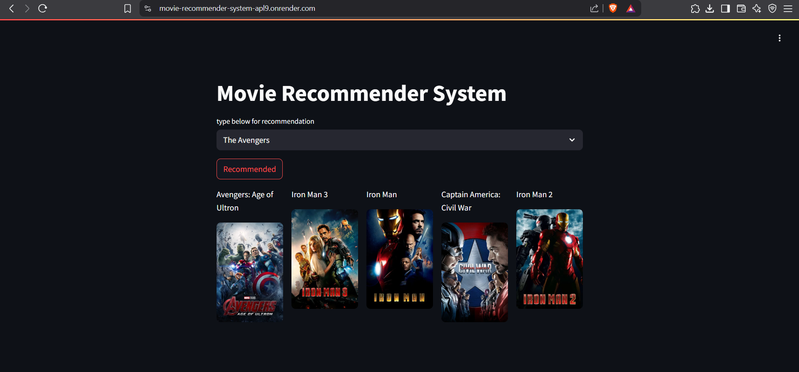

# 🎬 Movie Recommender System




A content-based Movie Recommender System built using **Streamlit**, **Python**, and **TMDB API** that suggests similar movies based on user input.

## 🚀 Features

- Interactive web interface using Streamlit
- Recommends 5 similar movies based on input
- Displays movie posters using TMDB API
- Uses cosine similarity on movie metadata
- Fast and easy to use

## 🧠 How It Works

1. Loads preprocessed movie data and similarity matrix (`movie_dict.pkl`, `similarity.pkl`).
2. Accepts a movie title from the user.
3. Calculates similarity scores with other movies.
4. Recommends top 5 similar movies with their posters fetched from TMDB.

## 🛠 Tech Stack

- **Python**
- **Streamlit** (for frontend)
- **Pandas** (data manipulation)
- **Pickle** (model/data loading)
- **Requests** (for TMDB API)
- **TMDB API** (for movie posters)

## 📦 Files

- `app.py` — Main Streamlit app
- `movie_dict.pkl` — Movie dataset with metadata
- `similarity.pkl` — Precomputed cosine similarity matrix

## 🔗 Live Demo

👉 [Click here to try the app](https://movie-recommender-system-apl9.onrender.com/)  


## 🔑 API Setup

This project uses TMDB API to fetch posters. You'll need a TMDB API Bearer Token.

1. Sign up at [https://www.themoviedb.org/](https://www.themoviedb.org/)
2. Navigate to your account > Settings > API
3. Replace the existing token in `fetch_poster()` with your own:

```python
"Authorization": "Bearer YOUR_TMDB_API_TOKEN"
